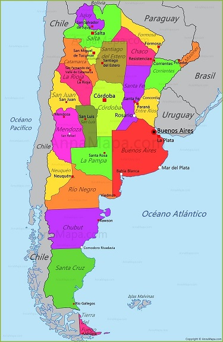

# Entorno General Empresa de Telecomunicaciones de Argentina 

## Pais
###  Argentina
- Poblacion:               46.044.703 (Instituto Nacional de Estadística y Censos (Indec)) Mayo.2020
#### Division Territorial  
*Entidades de 1er Nivel (24)*
- Ciudad autonoma de Buenos Aires (1)
- Provincias (22)
- Provincia de Buenos Aires (1)

*Entidades de 2do Nivel (530)*
- Departamentos  (380)
- Partidos       (135)  (Provincia de Buenos Aires)
- Comunas        (15)    (Ciudad de Buenos Aires)

*Entidades de 3er Nivel (530)*
- Municipios
- Distritos (Entre Rios y Santafe)
- Pedanias (Cordoba)
  
*Ciudades mas pobladas*
  a) Buenos Aires – 3 108 000 hab      
  b) Córdoba – 1 488 000 hab         (Provincia Cordoba)  
  c) Rosario – 1 307 000 hab         (Provincia Santa Fe)
  d) La Plata – 743 000 hab          (Provincia de Buenos Aires)
  e) Mar del Plata – 670 000 hab     (Provincia de Buenos Aires) 
  
*Provincias mas pobladas*
  a) Buenos Aires	                    17.569.053  
  b) Córdoba	                        3.978.984  
  c) Santa Fe	                        3.556.522  
  d) Ciudad Autónoma de Buenos Aires	3.120.612  
  e) Mendoza	                        2.014.533  

  Total de las 5 provincias mas pobladas = 30.239.704 (66%)

- Area (Km2) :             2.780.400
- Hab/Km2:                 16.56
- Poblacion Urbana (%):    92
- Viviendas:               17.805.711
- Edad:                    Edades predominantes entre los 5 a los 50 años
- Temperatura minima:      3 C   (Julio)
- Temperatura Maxima:      28 C (Enero)
- Inflacion:               94,8%
- Idioma:                  Español (97%)
- Moneda:                  Peso Argentino (1 Dolar = 26525 Pesos  14/07/23)

### Riesgos Especificos Argentina

[httpss://www.bloomberglinea.com/2023/01/11/5-riesgos-clave-que-enfrenta-argentina-desde-2023-segun-el-foro-economico-mundial/]

1. Inflacion rapida y sostenida
2. Crisis de deuda
3. Proliferacion de actividades economicas ilicitas
4. Colapso del Estado (erosion de instituciones y estado de Derecho, disturbios civiles internos y golpes militares, efectos de una grave inestabilidad regional o mundial
5. Crisis grave de suministro de suministro de materias primas

### Media de conexiones Argentina

- 2020 62.12 millones
- 2021 66.69 millones (Crecimiento del 7%)

### Velocidades medias de internet

#### Internet de banda ancha
- 61,19 Mbps; velocidad descarga (Puesto 69 a nivel mundial)
- 25,82 Mbps velocidad de subida (Puesto 78°).

#### Internet móvil (tabletas y smartphones) 
- 24,25 Mbit/segundo; velocidad descarga (Puesto 92)
- 7 Mbi/segundo; velocidad de subida, (Puesto 123)

### Tarifa de telefonia movil

Usuario Argentino gasta el 4% de su renta en telefonia movil (Nivel mundial 6,6%)

### Cobertura Internet

- Cobertura 4G:   97,68%
- Acceso Internet desde 2019 a 2021: Entre el 80% y 90% (Creciente). A nivel mundial 63.10%

### Lineas Fijas

- 16-17% promedio desde 2019. Estable

### Telefonos Moviles

- 125% promedio desde 2019

# Servicios Empresa

- (1)   **Internet**. *Más Importante*
- (2)   Telefonia Fija
- (3)   Telefonia Movil
- (4)   Television
- (5)   Radio

# Objetivo Principal Empresa

- Acceso a servicios

# Objetivos Secundarios Empresa

- Calidad de servicio
- Identificar oportunidades de crecimiento
- Plantear soluciones personalizadas a sus posibles clientes

# Requerimiento Principal del cliente
# Rol a desarrollar de nuestra parte

- Analisis del sector telecomunicaciones a nivel nacional para lograr **Objetivo Principal** y **Secundarios**
